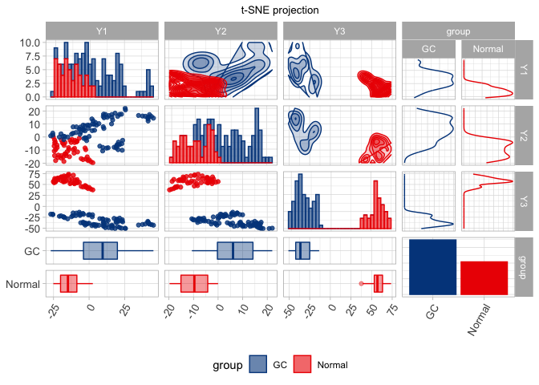

1st\_feature\_selection
================
Zongchao
8/30/2021

# Data prep

``` r
data = read_excel('./data/try_lzc_20210830.xlsx') %>% .[,-c(3,738:770)]
selected_52 = read_excel('./data/52.xlsx') %>% pull(.)
data_52 = data[c("ID", "stage", selected_52)]
```

# t-SNE demo

``` r
plot.tsne = function(data = data_52[,-c(1:2)], p, cat = 3){
  
# modeling
require(Rtsne)
set.seed(1234)
tsne_out = Rtsne(data, perplexity = p, dims = 3, max_iter = 5000)
pdat = data.frame(tsne_out$Y,data$stage)
colnames(pdat) = c("Y1","Y2","Y3", "group")

# plot 3d
require(gg3D)
require(scatterplot3d)
cols = c("orange","darkgreen", "darkblue")
if(cat == 3){
with(pdat, 
     scatterplot3d(Y2,
                   Y1, 
                   Y3, 
                   main="t-SNE projection",
                   xlab = "x",
                   ylab = "y",
                   zlab = "z",
                   pch = 16,
                   color = cols[as.numeric(factor(pdat$group, levels = c("Normal","EGC","AGC")))]))
legend("bottomright", legend = levels(factor(pdat$group)),
      col =  c("darkblue","orange","darkgreen"),
      pch = 16, title = "Outcome", cex = 0.8)}
else
      {
        with(pdat, 
     scatterplot3d(Y2,
                   Y1, 
                   Y3, 
                   main="t-SNE projection",
                   xlab = "x",
                   ylab = "y",
                   zlab = "z",
                   pch = 16,
                   color = cols[as.numeric(factor(pdat$group, levels = c("Normal","GC")))]))
legend("bottomright", legend = levels(factor(pdat$group)),
      col =  c("orange","darkgreen", "darkblue"),
      pch = 16, title = "Outcome", cex = 0.8)
      }

# plot 2d
require(GGally)
ggpairs(pdat, progress = F,
        mapping = ggplot2::aes(color = group, fill = group, group = group),
        upper = list(continuous = wrap("density", alpha = 0.2), combo = wrap("facetdensity")),
        lower = list(continuous = wrap("points", alpha = 0.8), combo = wrap("box", alpha = 0.4)),
        diag = list(continuous = wrap("barDiag", alpha = 0.6)),
        title = "t-SNE projection",
        legend = 6) +
  ggsci::scale_color_lancet() +
    ggsci::scale_fill_lancet() +
  theme_light() +
  theme(plot.title = element_text(hjust = .5, size = 10),
        axis.text.x = element_text(angle = 60, vjust = 1, hjust = 1,size = 10),
        axis.text.y = element_text(size = 10),
        legend.position = "bottom")
}
```

# 数据变换

``` r
# logit
LogitTransform = function(p){
  return(log(p/(1-p)))
}

# ard sin
AsinTransform = function(p){
  return(asin(sqrt(p)))
}


data[,-c(1,2)] = data[,-c(1,2)] %>% mutate(across(where(is.character), is.numeric))


# arc sin
data[,-c(1,2)] = apply(data[,-c(1,2)], MARGIN = 2, AsinTransform)
```

# t-test

``` r
runt.test = function(df=data, stage_1 = "Normal", stage_2 = "AGC"){
  df_1 = subset(df, stage == stage_1)
  df_2 = subset(df, stage == stage_2)
  
  res_sum = data.frame()
  for (i in 3:ncol(df_1)) {
    t = t.test(df_1[,i],df_2[,i])
    res_row = data.frame(name = names(data)[i],
                         p = t$p.value)
  res_sum = rbind(res_sum, res_row)
  }
  return(res_sum)
}

univar.t.AGC = runt.test(stage_1 = "Normal", stage_2 = "AGC") %>% mutate(p.adj = p.adjust(p)) %>% filter(p.adj < 0.05) # 439, 59
univar.t.EGC = runt.test(stage_1 = "Normal", stage_2 = "EGC") %>% mutate(p.adj = p.adjust(p)) %>% filter(p.adj < 0.05) # 119, 18
```

# Boot lasso

``` r
lasso.x = as.matrix(data[,-c(1:2)])
lasso.y = factor(data$stage, levels = c("Normal", "EGC", "AGC"))

lasso.fit = bootLasso(x = lasso.x,
          y = lasso.y)

sum(lasso.fit$Beta != 0)
```

    ## [1] 34

``` r
lasso.selected = colnames(lasso.x)[which(lasso.fit$Beta != 0)]
lasso.selected
```

    ##  [1] "M5392B"    "GC32-2A"   "GC-244-2B" "GC87-2B"   "GC-262-2A" "GC-253-2B"
    ##  [7] "GC77-2A"   "GC-253-2A" "GC103-2A"  "GC20-2B"   "GC-430-2B" "GC44-2B"  
    ## [13] "GC-538-2A" "GC-395-2A" "GC-296-2A" "GC-589-2A" "GC-357-2B" "GC-555-2B"
    ## [19] "GC-524-2A" "GC-315-2A" "GC-345-2B" "GC-354-2B" "GC-457-2A" "GC-309-2B"
    ## [25] "GC-603-2B" "GC-309-2A" "GC-326-2A" "GC-496-2B" "GC-463-2B" "GC-374-2A"
    ## [31] "GC-529-2A" "GC-627-2B" "GC-312-2A" "GC-367-2B"

# RFE

``` r
runRFE = function(Funcs = rfFuncs, 
                  sizes = c(85, 100, 125, 150, 175,185,195,200,205,210),
                  method = NULL, family = NULL, if.caret = F, 
                  rfe.x = as.matrix(data[,-c(1:2)]),
                  rfe.y = factor(data$stage, levels = c("Normal", "EGC", "AGC"))){
  
  if(if.caret){
    set.seed(123)
      Profile = rfe(rfe.x,
                rfe.y,
                sizes = sizes,
                rfeControl = rfeControl(functions = Funcs),
                method = method,
                family = family)
  }else{
    set.seed(123)
    Profile = rfe(rfe.x,
                rfe.y,
                sizes = sizes,
                rfeControl = rfeControl(functions = Funcs))
  }

  p = ggplot(Profile)
  
  return(list(profile = Profile,
              num_overlap_t =   sum(Profile$optVariables %in% univar.t.AGC$name | Profile$optVariables %in% univar.t.EGC$name),
              num_overla_bolasso =   sum(Profile$optVariables %in% lasso.selected),
              plot = p))
}
```

# Remove highly correlated vars

``` r
rfe.x = as.matrix(data[,-c(1:2)])
rfe.y = factor(data$stage, levels = c("Normal", "EGC", "AGC"))
# calculate sd
rfe.x.corr = rfe.x[,-which(apply(rfe.x, 2, sd) == 0)]

corr.m = cor(rfe.x.corr)
corr.selected = findCorrelation(corr.m, cutoff = .7, verbose = F, names = TRUE)
rfe.x = as.matrix(data[,-c(1:2)] %>% select(corr.selected))
```

    ## Note: Using an external vector in selections is ambiguous.
    ## ℹ Use `all_of(corr.selected)` instead of `corr.selected` to silence this message.
    ## ℹ See <https://tidyselect.r-lib.org/reference/faq-external-vector.html>.
    ## This message is displayed once per session.

# Run RFE on several methods

``` r
GC_vs_N.x = as.matrix(data[,-c(1:2)] %>% select(corr.selected))
GC_vs_N.y = factor(ifelse(data$stage == "Normal", "Normal", "GC"), levels = c("Normal", "GC"))


# random forest - 3 cats
rfprofile.3cats = runRFE(Funcs = rfFuncs, sizes = c(85, 100, 125, 150, 175,185,195,200,205,210),
                         rfe.x = rfe.x, rfe.y = rfe.y)

# random forest - 2 cats
rfprofile.2cats = runRFE(Funcs = rfFuncs, sizes = c(85, 100, 125, 150, 175,185,195,200,205,210), rfe.x = GC_vs_N.x, rfe.y = GC_vs_N.y)
```

# Summary

``` r
# 3 分类选出的变量 - 185
var.3cats = rfprofile.3cats$profile$optVariables
# 2 分类选出的变量 - 175
var.2cats = rfprofile.2cats$profile$optVariables

plot.tsne(data = data[c("stage", var.3cats)], p =5)
```

    ## Loading required package: Rtsne

    ## Loading required package: gg3D

    ## Loading required package: scatterplot3d

    ## Loading required package: GGally

    ## Registered S3 method overwritten by 'GGally':
    ##   method from   
    ##   +.gg   ggplot2

<!-- -->

    ## `stat_bin()` using `bins = 30`. Pick better value with `binwidth`.

    ## `stat_bin()` using `bins = 30`. Pick better value with `binwidth`.
    ## `stat_bin()` using `bins = 30`. Pick better value with `binwidth`.
    ## `stat_bin()` using `bins = 30`. Pick better value with `binwidth`.

<!-- -->

``` r
t = data %>% mutate(stage = ifelse(stage == "Normal", "Normal", "GC"))
plot.tsne(data = t[c("stage", var.2cats)], p =5, cat = 2)
```

<!-- -->

    ## `stat_bin()` using `bins = 30`. Pick better value with `binwidth`.
    ## `stat_bin()` using `bins = 30`. Pick better value with `binwidth`.
    ## `stat_bin()` using `bins = 30`. Pick better value with `binwidth`.
    ## `stat_bin()` using `bins = 30`. Pick better value with `binwidth`.

<!-- -->
